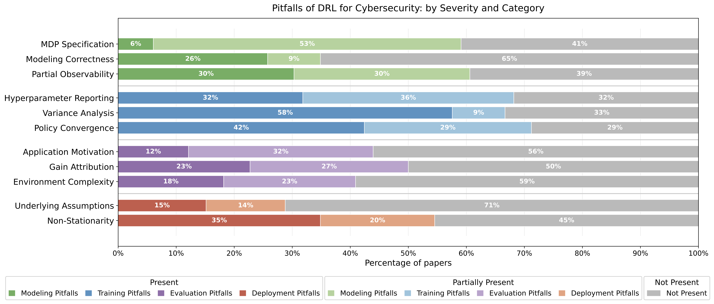

# SoK Paper Review Information
***

## Pitfall Prevalence

The breakdown of pitfall prevalence across the 66 DRL4Sec papers reviewed is as follows.

***

## Reviewer Agreement

The breakdown of the reviewer agreement across pitfalls is presented in the table below.

| Pitfall | Agreement | Kappa | Interpretation |
|---------|-----------|-------|----------------|
| MDP Specification | 75.8% | 0.579 | Moderate |
| Modelling Correctness | 89.4% | 0.797 | Substantial |
| Partial Observability | 72.7% | 0.583 | Moderate |
| Hyperparameter Reporting | 86.4% | 0.796 | Substantial |
| Variance Analysis | 89.4% | 0.798 | Substantial |
| Policy Convergence | 81.8% | 0.720 | Substantial |
| Application Motivation | 87.9% | 0.789 | Substantial |
| Gain Attribution | 74.2% | 0.594 | Moderate |
| Environment Complexity| 80.3% | 0.654 | Substantial |
| Underlying Assumptions | 80.3% | 0.570 | Moderate |
| Non-Stationarity | 78.8% | 0.663 | Substantial |

***

## Search Criteria

**Keywords**: We defined the following keywords after reviewing the proceedings of top security conferences (e.g.,
USENIX Security, IEEE S&P, ACM CCS, and NDSS) in order to collect a representative set of research on DRL being applied 
to differing cybersecurity tasks. ("Deep Reinforcement Learning") _and_ (cybersecurity _or_ "web security" _or_ fuzzing 
_or_ "vulnerability discovery" _or_ "vulnerability detection" _or_ "network defence" OR "network defense" _or_ malware 
_or_ evasion _or_ sqli _or_ xss _or_ "penetration testing" _or_ "cyber defence" _or_ "cyber defense" _or_ "network security" 
_or_ Dos _or_ "intrusion detection"). 

**Significance Criteria**: To ensure academic impact and quality, papers must satisfy at least one of the following criteria: 
(1) published in a first- or second-tier ([CORE-ranked A* or A](https://portal.core.edu.au/conf-ranks/)) venue in 
machine learning, software engineering, or security; or 
(2) demonstrate significant research impact by averaging more than 10 citations per year since publication 
from a included reputable publisher.

**Included Reputable Publishers**: Outside the explicitly included A*/A Venues: IEEE, ACM, Elsevier, Springer Nature, and PMLR.

**Topic Criteria**: We define the scope of papers to be included in our work as: _direct_ applications of DRL to _cybersecurity_ problems 
and have DRL as _the primary methodological contribution_. 
We then excluded several categories of related but out-of-scope work: 
(1) secondary studies (surveys, systematic reviews, etc.); 
(2) research on the security _of_ DRL systems, i.e., non-DRL-based attacks against DRL agents (which are not applied to 
_cybersecurity_ problems); (3) pure game-theoretic approaches without DRL; (4) non-deep RL methods (e.g., tabular Q-learning); and 
(5) Multi-Agent RL (MARL) systems, a separate research domain (which require distinct formulations and analysis). 

**Corpus Venue Breakdown**: The breakdown of papers per venue is as follows. _A*/A Conferences (24 papers)_: 
USENIX Security (3),  AAAI (3),  RAID (3), CCS (2), Euro S\&P (2), ISSTA (2), ACSAC (2), ASE (2), NDSS (1), Web Conf (1), 
NeurIPS (1), HPCA (1), ECCV (1). _Journals (31 Papers)_: IEEE Transactions (7), Elsevier (7), Springer Nature (5), 
ESORICS (5), IEEE Journals (3), Computers\&Security (2), ACM Transactions (2). _Other Venues (11)_. 

***